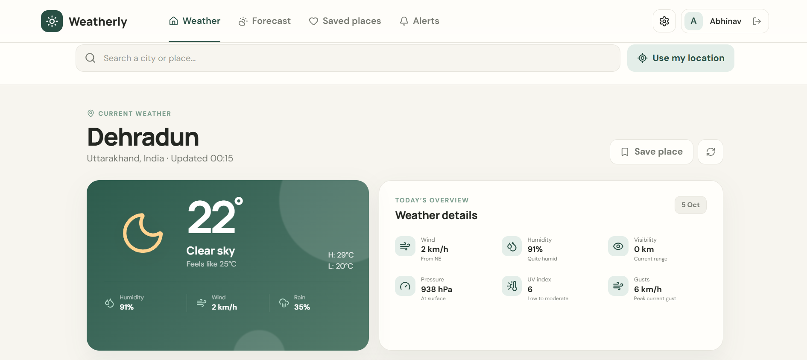

# 🌤️ Weatherly

A modern and responsive weather forecasting web application built with **React, TypeScript, and Vite**. Weatherly provides real-time weather information, forecasts, air-quality insights, weather alerts, and location-based weather data using the **Open-Meteo APIs**.

🔗 **Live Demo:** https://weatherly-two-sand.vercel.app

---

## 📸 Preview



---

## ✨ Features

- 🌡️ Current weather conditions
- 🕐 Hourly weather forecast
- 📅 7-day weather forecast
- 🔍 Global city search
- 📍 Current-location weather using browser geolocation
- 💨 Wind speed and gust information
- 💧 Humidity and precipitation details
- 👁️ Visibility and atmospheric pressure
- ☀️ UV index
- 🌅 Sunrise and sunset information
- 🌬️ Air-quality information
- ⚠️ Forecast-based weather alerts
- 🔖 Save frequently used locations
- 🌡️ Celsius / Fahrenheit unit switching
- 🌙 Light and dark themes
- 💾 Persistent preferences using browser storage
- 📱 Responsive interface for different screen sizes

---

## 🛠️ Tech Stack

| Technology | Usage |
| --- | --- |
| React | User interface |
| TypeScript | Type-safe application development |
| Vite | Development and production build tooling |
| CSS | Responsive UI and styling |
| Open-Meteo | Weather and forecast data |
| Open-Meteo Geocoding API | City search and location lookup |
| Open-Meteo Air Quality API | Air-quality information |
| Browser Geolocation API | Current-location detection |
| Local Storage | Saved locations and preferences |
| Vercel | Deployment |

---

## 🌐 API Integration

Weatherly uses the **Open-Meteo ecosystem** to retrieve weather information.

The application integrates:

- Weather Forecast API
- Geocoding API
- Air Quality API

Weather data is fetched dynamically based on the selected city's latitude and longitude.

---

## 🚀 Getting Started

### Prerequisites

Make sure **Node.js** and **npm** are installed on your system.

### Installation

Clone the repository:

```bash
git clone https://github.com/26-Abhinav/Weatherly.git
```

Navigate to the project directory:

```bash
cd Weatherly
```

Install dependencies:

```bash
npm install
```

Start the development server:

```bash
npm run dev
```

Open the local URL displayed by Vite in your browser.

---

## 📦 Production Build

Create an optimized production build:

```bash
npm run build
```

Run ESLint:

```bash
npm run lint
```

---

## 📁 Project Structure

```text
Weatherly/
├── screenshots/
│   └── weatherly-dashboard.png
├── src/
│   ├── App.tsx
│   ├── AuthPage.tsx
│   ├── main.tsx
│   ├── styles.css
│   ├── types.ts
│   ├── vite-env.d.ts
│   └── weather.ts
├── .gitignore
├── eslint.config.js
├── index.html
├── package.json
├── package-lock.json
├── tsconfig.app.json
├── tsconfig.json
├── tsconfig.node.json
└── vite.config.ts
```

---

## 🔐 Account Experience

Weatherly currently includes a **local-first account experience** for demonstrating personalized application behavior. Saved locations and user preferences are persisted in the browser.

A production authentication service and cloud database can be integrated in a future version.

---

## 🔮 Future Improvements

- Backend authentication and database integration
- Cross-device synchronization of saved locations
- Push notifications for severe weather
- Interactive weather maps
- Historical weather analytics
- Additional accessibility improvements

---

## 🌍 Deployment

The application is deployed on **Vercel**.

**Live Application:**  
https://weatherly-two-sand.vercel.app

---

## 👨‍💻 Author

**Abhinav**

GitHub: [26-Abhinav](https://github.com/26-Abhinav)

---

If you found this project useful, consider giving the repository a ⭐.